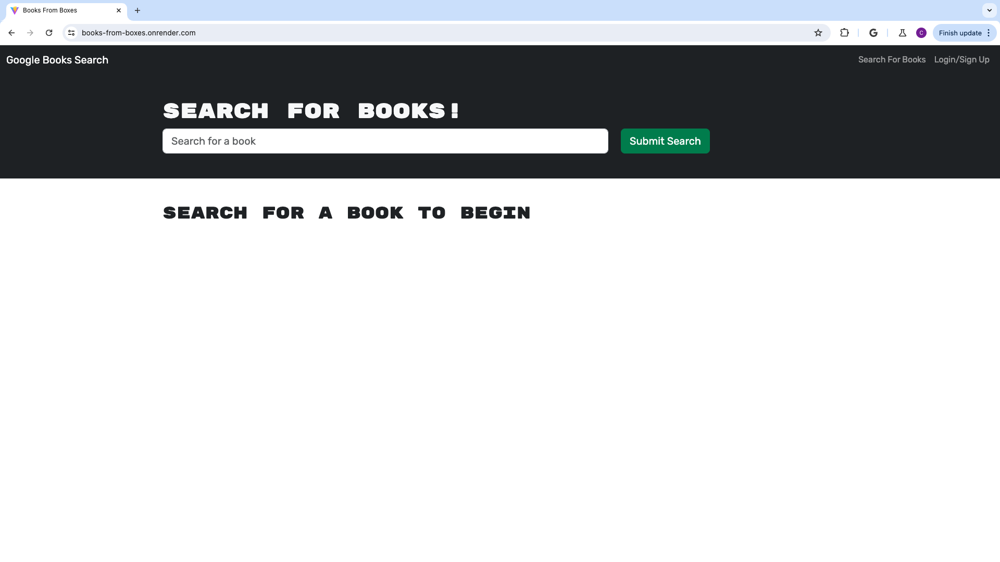
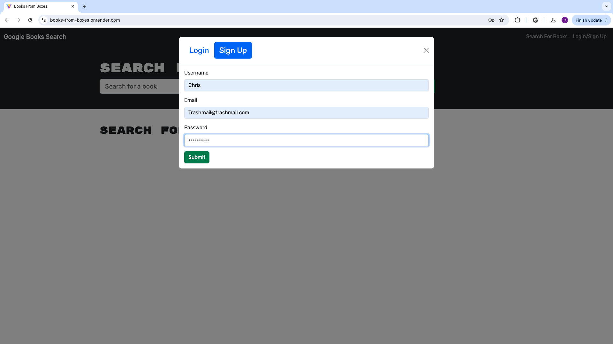
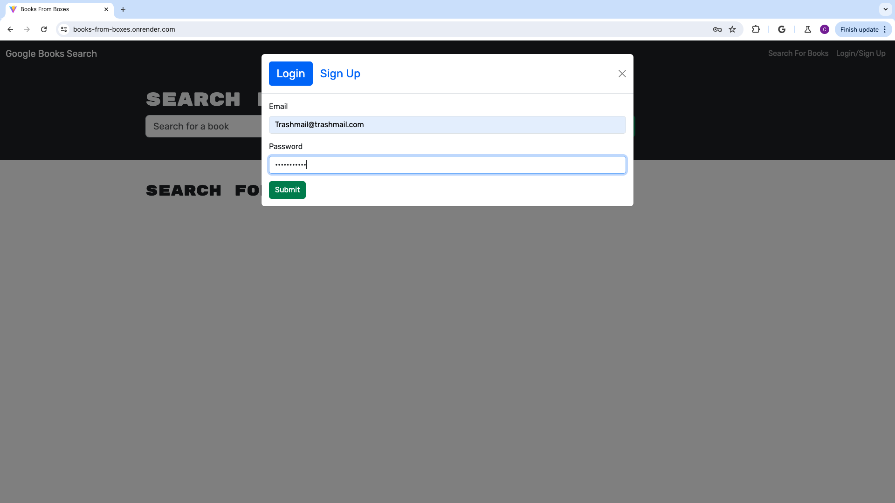
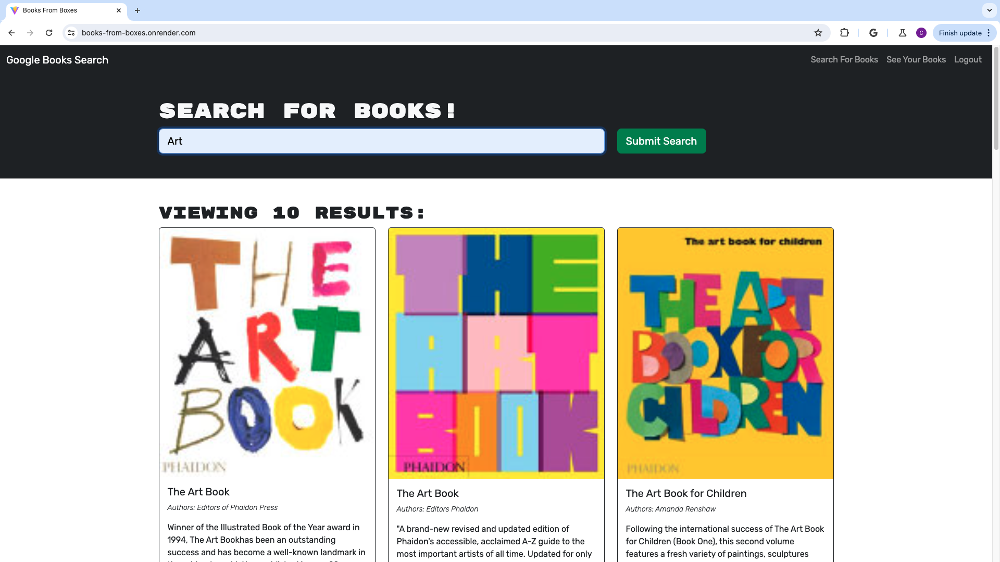
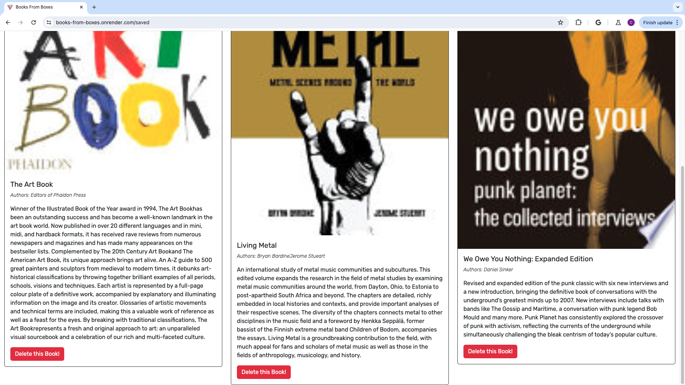
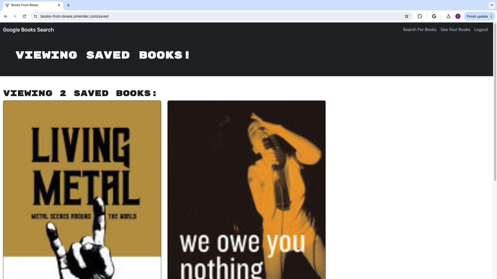

# books-from-boxes
Book search engine

# MERN Book Search Engine

Welcome to my personal React Portfolio. This single-page application showcases my development projects and skills, serving as a hub for both potential employers and fellow developers.

## Table of Content

- [Description](#description)
- [Usage](#usage)
- [Features](#features)
- [Prerequisites](#prerequisites)
- [Installation](#installation)
- [Running the Application](#running-the-application)
- [Technical Details](#technical-details)
- [Acknowledgements](#acknowledgements)
- [License](#license)

## Description

The Book Search Engine is a MERN stack application that integrates with the Google Books API. Users can search for books, save their favorites, and manage a personal collection and also allow the user to visit Google to purchase books. The application has been refactored to use GraphQL with Apollo Server, providing a more efficient and modern user experience.

## Usage

The application provides features for searching books, saving favorites, and managing a personal book collection with user authentication for a personalized experience.

## Features

- Real-time book search with Google Books API integration.
- GraphQL API with Apollo Server for efficient data interaction.
- User authentication for maintaining a personalized book collection.
- Responsive web design for cross-device compatibility.

### Prerequisites

- MongoDB
- Node.js and npm (Node Package Manager)

### Installation

To install this application locally:

1. Clone the repository:
   git clone https://github.com/CRNaro/books-from-boxes.git
2. Navigate to the project directory:
   cd books-from-boxes
3. Install dependencies:
   npm install

### Running the Application

Run through already deployed site:
https://books-from-boxes.onrender.com

Run the application on your local machine:
1. Start the server:
   npm start
2. Visit `http://localhost:3000` in your browser.

## Screenshots of Project

## Technical Details

### Back-End Specifications

- **auth.js**: Updated auth middleware to work with GraphQL API.
- **server.js**: Implemented Apollo Server as middleware for Express server.
- **Schemas**:
  - **index.js**: Exports typeDefs and resolvers.
  - **resolvers.js**: Query and mutation functionality for Mongoose models.
  - **typeDefs.js**: Necessary Query and Mutation types defined.

### Front-End Specifications

- **queries.js**: Holds the `GET_ME` query.
- **mutations.js**: Contains mutations for `LOGIN_USER`, `ADD_USER`, `SAVE_BOOK`, and `REMOVE_BOOK`.
- **App.jsx**: Apollo Provider implemented to interact with Apollo Server.
- **SearchBooks.jsx**: `SAVE_BOOK` mutation used in `handleSaveBook()` function.
- **SavedBooks.jsx**: `GET_ME` query and `REMOVE_BOOK` mutation integrated.
- **SignupForm.jsx**: `ADD_USER` mutation replaces `addUser()` function.
- **LoginForm.jsx**: `LOGIN_USER` mutation replaces `loginUser()` function.

## Acknowledgements

Special thanks to:

Referenced following websites:
- https://stackoverflow.com
- https://www.w3schools.com

Special thanks to Xpert, the AI Learning Assistant, for providing valuable assistance and guidance.
Lada Jerabek, with out you I would not be able to do ANY of this.  Thank you.

## License

---MIT License

Copyright (c) [2023] [Christopher Robert Naro]

Permission is hereby granted, free of charge, to any person obtaining a copy
of this software and associated documentation files (the "Software"), to deal
in the Software without restriction, including without limitation the rights
to use, copy, modify, merge, publish, distribute, sublicense, and/or sell
copies of the Software, and to permit persons to whom the Software is
furnished to do so, subject to the following conditions:
The above copyright notice and this permission notice shall be included in all
copies or substantial portions of the Software.
THE SOFTWARE IS PROVIDED "AS IS", WITHOUT WARRANTY OF ANY KIND, EXPRESS OR
IMPLIED, INCLUDING BUT NOT LIMITED TO THE WARRANTIES OF MERCHANTABILITY,
FITNESS FOR A PARTICULAR PURPOSE AND NONINFRINGEMENT. IN NO EVENT SHALL THE
AUTHORS OR COPYRIGHT HOLDERS BE LIABLE FOR ANY CLAIM, DAMAGES OR OTHER
LIABILITY, WHETHER IN AN ACTION OF CONTRACT, TORT OR OTHERWISE, ARISING FROM,
OUT OF OR IN CONNECTION WITH THE SOFTWARE OR THE USE OR OTHER DEALINGS IN THE
SOFTWARE.
🏆 The previous sections are the bare minimum, and your project will ultimately determine the content of this document. You might also want to consider adding the following sections.

